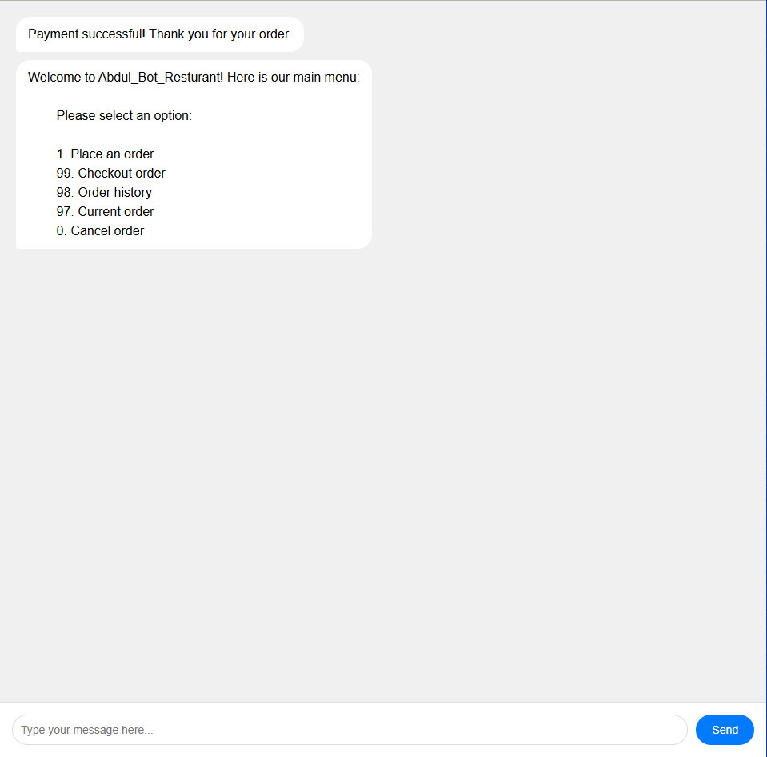

# Abdul_Bot_Restaurant


A restaurant chatbot that allow our customers to browse a menu, place orders, and pay securely with paystack. All these interactions are done number-based chat interface

## Demo



🔗 [Live Demo](https://abdul-bot-resturant.onrender.com)

## Features

- 🛒 Browse menu by category (Main Dish, Sides, Drinks)
- 📝 Add multiple items to an order
- 👀 View current order and order history
- ❌ Cancel pending orders
- 💳 Secure payment via Paystack
- 🍪 Device-based sessions (no login required)
- ✅ Input validation with Joi

## Tech Stack

| Layer | Technology |
|---|---|
| Runtime | Node.js |
| Framework | Express.js |
| Database | MongoDB + Mongoose |
| Payment | Paystack |
| Validation | Joi |
| Frontend | Vanilla HTML/CSS/JS |


## Prerequisites

- [Node.js](https://nodejs.org/) (v16 or higher)
- A [MongoDB Atlas](https://www.mongodb.com/atlas) account
- A [Paystack](https://paystack.com) test account


## Getting Started

### 1. Clone the repository

```bash
git clone https://github.com/mujab-ayo/Abdul_Bot_Resturant.git
cd restaurant-chatbot
```

### 2. Install dependencies

```bash
npm install
```

### 3. Set up environment variables

Create a `.env` file in the root of the project:
```

PORT=3000
MONGO_URI=your_mongodb_connection_string
Paystack_Test_Secret_Key=sk_test_your_paystack_secret_key
```

### 4. Seed the menu

This load the menuItem into the database (You can edit menuItem to suite your preference)

```bash
npm run seed
```

### 5. Start the server

```bash
# Development (with auto-restart)
npm run dev

# Production
npm start
```

### 6. Open the app

Visit `http://localhost:3000` in your browser.

## How to Use

Once the app is running, interact with the bot using these commands:

| Input | Action |
|---|---|
| `1` | Browse menu and place an order |
| `99` | Checkout and pay |
| `98` | View order history |
| `97` | View current order |
| `0` | Cancel current order |

Click on success on the paystack authorization page to see the success reaction 

## API Endpoints

| Method | Endpoint | Description |
|---|---|---|
| GET | `/api/chat` | Get initial greeting |
| POST | `/api/chat/send-message` | Send a message to the bot |
| GET | `/api/payment/callback` | Paystack payment callback |